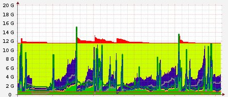

<section>
	<h2>Configuración automática de infraestructura</h2>
		<small>
			<a href="http://www.josedomingo.org">José Domingo Muñoz Rodríguez</a>
		</small>
	

		
	

	
<small>Theme by: <a href="http://lab.hakim.se/reveal-js/#/">reveal.js</a></small>

</section>
<section>
	<section>
		<h2>Infraestructura: Evolución</h2>
    	<h3>¿A qué llamamos infraestructura?</h3>
    	
Equipos para procesamiento, conexión y almacenamiento de datos

	    <h3>Evolución</h3>
    	<ol>
      		<li>Equipos físicos</li>
      		<li>Máquinas virtuales</li>
      		<li>Infraestructura en la nube</li>
		</ol>
	</section>
	<section>
		
El cloud computing o computación en la nube ofrece servicios de forma ágil y sencilla a través de la red. Algunas características:

		<ul>
		 	<li>Servicio disponible de forma automática y a demanda</li>
		 	<li>Accesible a través de la red</li>
            <li>Elasticidad</li>
			<li>Pago por uso</li>
		</ul>
		
Estas características nos obligan a cambiar nuestra forma de crear/eliminar infraestructura y de configurar los servicios que ofrecen.

	</section>
</section>
<section>
	
	<section>
		<h3>Recursos elásticos</h3>
		<ul>
		<li>Demanda variable: web</li>
		
		<li><strong>Solución:</strong> Elasticidad y escalado horizontal</li>
		<li><strong>Automatización en la creación y destrucción de nodos</strong></li>
		</ul>
	</section>
	<section>
		<h3>Microservicios</h3>
		<ul>
		<li>Normalmente a través de contenedores</li>
		<li>¿Qué infraestructura para las máquinas físicas/virtuales, redes y volúmenes?</li>
		<li>¿Vamos a gestionar esta infraestructura a mano?</li>
		</ul>
	</section>
	<section>
		<h3>Infraestructura como código</h3>
		<ul>
		<li>La configuración es nuestro código</li>
		<li>Entornos de desarrollo, prueba y producción</li>
		<li>Metodologías ágiles</li>
		<li>Entrega continua/Despliegue continuo</li>
		</ul>
	</section>
	<section>
		<h3>Big Data</h3>
		<ul>
		<li>Necesidad de grandes recursos</li>
		<li>Cargas variables e impredecibles</li>
		<li>1 maquina 100 horas o 100 máquinas 1 hora</li>
		<li>Creación automática de escenarios</li>
		</ul>
	</section>
	<section>
		<h3>Función como servicio</h3>
		<ul>
		<li>"Serverless"</li>
		<li>Ejecutamos código directamente en la nube</li>
		<li>¿Infraestructura?</li>
		</ul>
	</section>
	
</section>
<!-- 	<section> -->
<!-- 		<h4>Automatización de la configuración</h4> -->
<!--     <ul> -->
<!--     <li>La automatización es cada vez más habitual en entornos de -->
<!--       infraestructura clásica (máquinas físicas o virtuales)</li> -->
<!--     <li>La automatización es <strong>obligatoria</strong> en -->
<!--       entornos de IaaS donde los elementos se crean y eliminan a -->
<!--       demanda de forma muy rápida</li> -->
<!--   </ul> -->
<!-- </section> -->
<!-- <section> -->
<!--   <h3>¿Por qué programamos la Infraestructura?</h3> -->
<!--   <ul> -->
<!--     <li>En el desplegue moderno de aplicaciones web es indispensable acercar los entornos de desarrollo, prueba y producción. </li> -->
<!--     <li>Por la elasticidad que nos ofrece el Cloud Computing. Los recursos pueden aumentar bajo demanda.</li> -->
<!--     <li>Para menejar tu infraestructura como tu software</li> -->
<!--     
<h4>DevOps...<em>¿Esoqueloqué?</em></h4>
 -->
<!--   </ul> -->
<!-- </section> -->
<section>
	<section>
		<h3>¿Qué programamos?</h3>
		<ul>
		<li>Escenarios: MV, redes o almacenamiento</li>
		<li>Configuración de sistemas o aplicaciones</li>
		<li>Recursos de alto nivel: DNSaaS, LBaaS, DBaaS, ...</li>
		<li>Respuestas ante eventos</li>
		</ul>
	</section>
	<section>
		<h3>¿No hablamos de lo mismo?</h3>
		
<em>¿Hay diferencias entre crear un escenario y configurar el software de la infraestructura creada?</em>

	<!-- 
<h1>NO HAY DIFERENCIAS!!!</h1>
 -->
	</section>
</section>
<section>
	<section>
		<h3>Herramientas</h3>
		<ul>
		<li>Lenguajes de programación</li>
		<li>Software de orquestación</li>
		<li>Software de gestión de la configuración</li>
		</ul>
		
... y de software libre ;)

	</section>
	<section>
		<h3>Orquestación</h3>
		<ul>
		<li>Vagrant (escenarios simples)</li>
		<li>Cloudformation (AWS)</li>
		<li>Heat (OpenStack)</li>
		<li>Terraform</li>
		<li>Juju</li>
		</ul>
	</section>
	<section>
		<h3>Gestión de la configuración</h3>
		<ul>
		<li>Puppet</li>
		<li>Chef</li>
		<li>Ansible</li>
		<li>Salt (SaltStack)</li>
		</ul>
	</section>
</section>
<section>
  <h1>Demo</h1>
</section>
